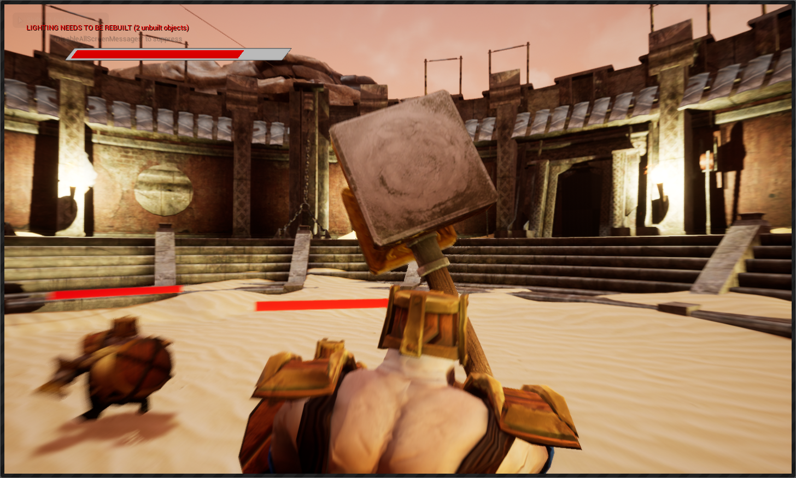
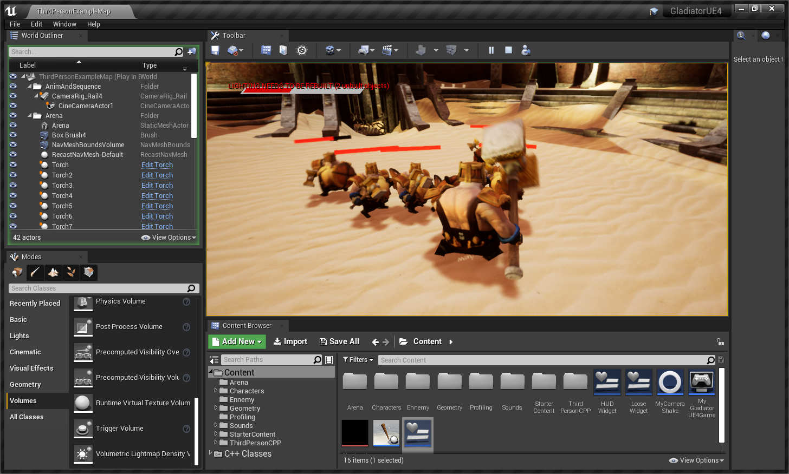

# GladiatorUE4
UE4 project game programming second year. Made by Six Jonathan for introduction to Unreal cpp. 2 weeks

Incarne a gladiator and kill your ennemies in amazing arena !

## Screenshot:

## Command :
WASD : move
Left clic : attack
Right click : block
K : debug/FPS
Escape : Quite

## TODO (French) : 
### Caméra :
- [x] Le joueur contrôle une third-person camera avec la souris
- [x] La caméra ne doit pas rentrer dans le décors
- [x] La caméra ne doit effectuer aucun test de collision avec des ennemis (cela aurait pour effet de la rapprocher de très près du joueur lorsqu'un ennemi attaque, ce qui n'est pas pratique du point de vue du jeu)

### Player :
- [x] le joueur peut déplacer son personnage dans l'environnement en utilisant Z, S,Q, D (qui déplace le personnage du joueur en avant, à gauche, en arrière, à droite dans la référence de la caméra)
- [x] Le personnage du joueur doit toujours s’orienter dans la direction dans laquelle il se déplace, il ne doit jamais strafe, ni reculer.
- [x] Le joueur commence avec 5 points de la vie (cette valeur devrait être facilement ajustable dans l'éditeur)

### Player attaque :
- [x] Lorsque le joueur appuie sur le bouton gauche de la souris, son personnage attaque et l'animation d'attaque est jouée
- [x] Pendant l’attaque, le joueur ne peut pas se déplacer
- [x] L'attaque doit vérifier s'il y a collision pour voir si un ennemi est touché (ce test doit être effectué au bon moment de l'animation de l'attaque pour que le joueur se sente bien dans le jeu)
- [x] Si l'ennemi est touché, un effet visuel doit apparaître pour indiquer clairement au joueur que son attaque a bien touchée. (Cela peut être une particule ou une couleur de matériau temporaire qui vire au rouge, cela n’a aucune importance tant que le retour est évident pour le joueur)
- [x] Dans ce cas, l’ennemie touché perd un point de vie

### Player defense : 
- [x] Lorsque le joueur appuis sur le bouton droit de la souris, son personnage défend et lève le bouclier tant que le bouton n’est pas relâcher
- [x] En défense le personnage bloque toutes attaques frontal mais ne peut plus bouger, ni s'orienter

### Ennemis :
- [x] Quand le jeu commence, il y a 5 ennemis dans l'arène
- [x] Ils ont tous 3 points de vie

### IA - Position des ennemis :
- [x] En tant que groupe, ils ne restent pas trop loin du joueur, mais pas trop près pour des raisons évidentes de sécurité (pour éviter d'être  acilement attaqué par le joueur)
- [x] Chaque ennemi doit avoir une vue non obstruée du joueur, c'est-à-dire que pour chaque ennemi, la ligne de mire entre cet ennemi et le joueur ne doit pas se croiser avec d'autres ennemis
- [+] Sauf pendant l'attaque, l'ennemi doit toujours faire face au joueur, à tout moment. Par conséquent, les ennemis sont autorisés à se dégager et à reculer

### IA - Ennemis attaque :
- [x] Toutes les secondes (cette période devrait être une valeur ajustable dans l'éditeur), un ennemi est choisi pour attaquer le joueur
- [+] L’algorithme qui choisit l’ennemi pour attaquer appartient aux développeurs, dans la mesure où il rend le jeu aussi amusant que possible (choisissez un ennemi aléatoire, choisissez l’ennemi le plus proche, celui situé à l’arrière du joueur, le dernier attaquant récent, une combinaison des règles précédentes…)
- [x] L'attaquant choisi doit se déplacer vers le joueur, suffisamment près pour que l'attaque puisse l'atteindre. Il devrait alors déclencher l'attaque
- [+] Comme le joueur, l'ennemi ne peut pas se déplacer lorsqu'il attaque et une vérification de la collision doit être effectuée au bon moment pour détecter si le joueur est touché
- [x] Si le joueur est touché, il devra perdre un point de vie et un FX devra être joué afin de lui donner un retour évident qu'il a été attaqué
- [x] Une fois l'attaque terminée, l'ennemi doit revenir à sa position par défaut (pas trop près / pas trop loin du joueur)

### Mort :
- [x] Si un personnage (joueur ou ennemi) perd toute sa vie, l'animation de mort est jouée.
- [x] Une fois l'animation terminée, le personnage reste sur la dernière image (couché au sol), les collisions et la logique sont désactivés (le personnage devient simplement un élément graphique d'arrière-plan)

### Game state :
- [x] Lorsque tous les ennemis sont vaincus et que le joueur est toujours en vie, le jeu doit informer le joueur qu'il a gagné (affiche un texte «You Win», par exemple), et le jeu devrait être réinitialisé (joueur et ennemis respawn)
- [x] Lorsque le joueur perd toute sa vie, le jeu doit l'informer qu'il a perdu et le jeu doit être réinitialisé

### HUD :
- [x] Affichez, à votre guise, la santé du joueur (texte, jauge…)
- [x] La mise à jour du HUD doit être effectuée à l’aide de delegates et d’events